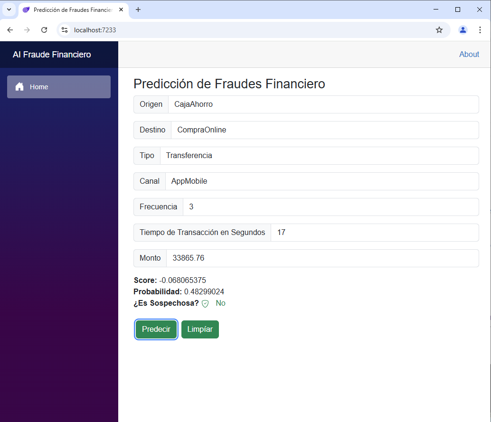

# Detección de Fraude Financiero mediante

La siguiente aplicación hace uso de IA (***Inteligencia Artificial***) para detectar movimientos u operaciones de transaccionales de dinero a través de cajeros ATM, aplicaciones móviles, etc. Esta aplicación hace uso de la librería ML de Microsoft. Para el proceso de detección se utiliza el algoritmo **SdcaLogisticRegression** que es de tipo regresión binaria para las evaluaciones básicas de tipos cotidianos de tipos de transacciones operativas que podrían resultar sospechosas de fraude. No obstante, se ha incluido una clase más donde se añade otro tipo de algoritmos tales como **FastTree** o **FastForest** y que resultan algo más sofisticados que **SdcaLogisticRegression**. 

Por último, el uso de estos últimos podría ser útil para una búisqueda más profunda o específica. Por último, cabe señalar que la mejor performance tan solo se puede lograr probando cada uno de estos tipos de algoritmos. No existe un algoritmo universal eficaz para todo un universo de casos. En este caso se requiere de análisis y pruebas exahustivas. 

## Interface Gráfica 

En las siguientes dos capturas de imagenes se muestra la resultante de algunas pruebas que determinan si una transacción podría tratarse de un potencial fraude o no. 

### Caso de Potencial Fraude 

 

### Caso de Operación Normal 

## El Algoritmo SdcaLogisticRegression 

El algoritmo **SdcaLogisticRegression** es una implementación de la regresión logística binaria utilizando el optimizador SDCA (***Stochastic Dual Coordinate Ascent***). Esta técnica se aplica principalmente en tareas de clasificación binaria y está disponible en el marco de aprendizaje automático de Microsoft, ML.NET. Su fortaleza radica en la capacidad de escalar eficientemente a grandes conjuntos de datos, manteniendo al mismo tiempo la precisión del modelo.

Regresión logística es un modelo estadístico ampliamente utilizado que predice la probabilidad de una clase binaria. En lugar de predecir una etiqueta directamente, estima la probabilidad de que una observación pertenezca a una clase específica (por ejemplo, positivo o negativo), utilizando como función de activación la función sigmoide. La salida está en el rango continuo entre 0 y 1, lo que permite interpretarla como una probabilidad.

La parte más interesante del algoritmo es el uso de SDCA (***Stochastic Dual Coordinate Ascent***) como método de optimización. A diferencia de otros algoritmos como SGD (***Gradiente Descendente Estocástico***), SDCA trabaja en el dominio dual del problema de optimización. Esto le permite actualizar las variables duales de forma individual y estocástica (una a la vez o por pequeños bloques), lo que resulta en un entrenamiento eficiente y estable, especialmente útil en problemas con grandes volúmenes de datos.

SDCA garantiza la convergencia en funciones convexas, como es el caso de la regresión logística, y optimiza directamente la función de pérdida logística regularizada con L2 o elastic net. Esta regularización evita el sobreajuste, controlando la magnitud de los coeficientes del modelo.

El proceso general sigue los siguientes pasos:

1. Se inicializan los pesos del modelo y las variables duales.

2. Se seleccionan aleatoriamente ejemplos del conjunto de entrenamiento.

3. Para cada ejemplo, se actualiza su correspondiente variable dual utilizando una fórmula cerrada derivada del problema dual.

4. A partir de las variables duales, se actualizan los pesos del modelo.

5. Este proceso se repite hasta que el modelo alcanza una convergencia determinada o hasta cumplir con un número máximo de iteraciones.

El resultado es un modelo de regresión logística entrenado que puede predecir la probabilidad de una clase positiva, útil en contextos como detección de fraudes, análisis de sentimientos, diagnósticos médicos, entre otros.

***SdcaLogisticRegression*** en ML.NET es una opción recomendada cuando se necesita una solución rápida, eficiente y escalable para clasificación binaria, especialmente si el conjunto de datos es grande o disperso (sparse). Es un algoritmo determinista, lo que significa que produce los mismos resultados bajo las mismas condiciones, algo muy valorado en entornos industriales.

## El Algoritmo FastTree

El algoritmo FastTree es una implementación optimizada del conocido método de GBDT (***Gradient Boosted Decision Trees***), diseñado específicamente para ofrecer alto rendimiento y precisión en tareas tanto de clasificación binaria como de regresión. Se trata de un algoritmo de aprendizaje supervisado basado en árboles de decisión, el cual mejora iterativamente el modelo al corregir los errores de predicciones anteriores mediante el enfoque de boosting de gradiente.

En esencia, **FastTree** construye el modelo de forma aditiva: comienza con un árbol de decisión base, y en cada iteración posterior agrega un nuevo árbol que trata de corregir los errores residuales de los árboles anteriores. Este proceso se repite hasta alcanzar un número determinado de iteraciones o hasta que la mejora entre iteraciones sea insignificante. A diferencia de técnicas tradicionales como bagging o Random Forests, donde cada modelo se entrena de forma independiente, FastTree utiliza un proceso secuencial y acumulativo.

Lo que distingue a **FastTree** es su eficiencia algorítmica. Fue diseñado para manejar conjuntos de datos grandes y dispersos mediante una implementación especializada del algoritmo de boosting que optimiza el cálculo de los residuos y la construcción de los árboles. Utiliza una estrategia basada en histogramas para calcular las divisiones de forma más rápida, y también implementa técnicas como la poda anticipada (early stopping) y la compresión del modelo para acelerar el proceso de entrenamiento sin sacrificar precisión.

**FastTree** utiliza funciones de pérdida diferenciables, como la función logística para clasificación y el error cuadrático medio para regresión, y ajusta los pesos de los nodos hoja de cada árbol a través de técnicas de optimización de segundo orden, lo que contribuye a una convergencia más rápida y precisa.

Este algoritmo es especialmente útil en escenarios donde se necesita una combinación de velocidad, precisión y capacidad de interpretación, como en motores de recomendación, predicción de abandono de clientes, o detección de anomalías.

## El Algoritmo FastForest

El algoritmo **FastForest** es la implementación de Microsoft del método Random Forest, diseñado para realizar tareas de clasificación binaria, clasificación multiclase y regresión. A diferencia de FastTree, que usa boosting, FastForest utiliza el principio de bagging (***Bootstrap Aggregation***), lo que implica construir muchos árboles de decisión independientes y luego combinar sus resultados para obtener una predicción final robusta.

**FastForest** crea un conjunto de árboles de decisión entrenados con distintas muestras aleatorias del conjunto de datos original (con reemplazo). Cada árbol es entrenado independientemente y con un subconjunto aleatorio de características en cada división, lo que introduce diversidad y reduce el riesgo de sobreajuste. Para clasificación, el modelo final toma una votación mayoritaria entre los árboles; para regresión, calcula un promedio.

La principal ventaja de **FastForest** reside en su capacidad de generalización y robustez frente al ruido. Gracias a su enfoque en la aleatorización y la agregación, es menos propenso a sobreajustarse a datos con ruido o características irrelevantes. Además, es naturalmente paralelizable, lo que permite una mejora significativa del tiempo de entrenamiento en ambientes con múltiples núcleos o hilos de procesamiento.

En comparación con **FastTree**, **FastForest** suele ser más estable, pero menos preciso en ciertos contextos, ya que no realiza ajustes finos sobre los errores como lo hace el boosting. Sin embargo, es más fácil de interpretar, y menos sensible a los hiperparámetros como la tasa de aprendizaje o la profundidad máxima del árbol.

FastForest resulta ideal cuando se busca un equilibrio entre rendimiento, escalabilidad y simplicidad, y es ampliamente utilizado en tareas como clasificación de riesgo crediticio, predicción de enfermedades, segmentación de clientes, y análisis de series temporales.

## Funcionamiento 

En la base de datos para el proveedor MySQL Server se ha creado una base de datos que posee dos tablas. Una tabla contiene los datos registrados de todas las operaciones y otra tabla utilizada para almacenar el entrenamiento de los datos. Por tanto, cuando se entrena los datos de origen, luego del proceso de ajuste para dicho entrenamiento, los datos entrenados se almacenan en una talba para potesriormente ser utilizado para las futuras predicciones. 

La solución contiene dos librerías y dos aplicaciones, siendo una de ellas la API y la segunda una aplicación de cliente. Una de las librerías se encarga de gestionar las operaciones de persistencia en la base de datos. Para obtener una mejor eficacia en la concurrencia de datos. Por otra parte, hace uso de un conjunto de herramientas fáciles de utilizar para proceder con el almacenamiento, eliminación y lectura de los datos. 

La otra librería se encarga de gestionar los servicios vinculados a la Inteligencia Artificial. Aquí particularmente hacemos uso de los procesos de entrenamiento, análisis y predicciones, haciendo uso del algoritmo que más convenga para el propósito operativo. 

La solución que alberga cuatro proyectos hace uso de una arquitectura de microservicios para su correcto funcionamiento. Tenemos la API que corre en un servicio mientras la aplicación cliente Web corre en otro. Las librerías separadas tiene como fine optimizar el rendimiento de la solución. En breve, las DLL se crean de forma separada lo que otorga una mejor prestación operativa de la aplicación en general. 

## Instrucciones para Descargar, Desplegar y Ejecutar la Solución 

Antes de proceder resulta necesario contar con un gestor de base de datos de MySQL Server community versión 8. Si embargo, en este caso particular he utilizado una base de datos algo antigua 5.6.21. Nada impide que utilice la versión 8 y quizá sería lo mejor. Sin embargo, tenga en cuenta que es probable que si utilice esta nueva versión tenga que adaptar la lógica del negocio de la librería de gestión de la base de datos y sus dependencias. 

En la carpeta docs de este repositorio se encontrará con una serie de archivos importantes. El archivo de script ***init_db_transacciones.sql*** posee el script de SQL que requiere para la creación de la base de datos, las tablas y los valores almacenados. Por tanto, descargue y ejecute este script para que su base de datos esté lista para utilizarse. 

Luego, prepare la solución para poder posteriormente ejecutar y hacer las pruebas deseadas. 

---

@Autor: Ariel Alejandro Wagner